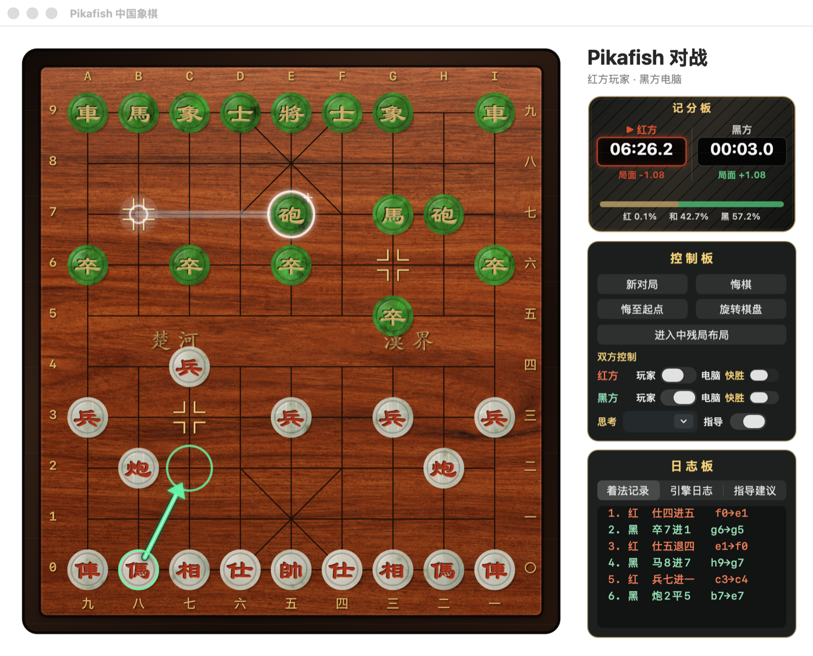

# Pikafish macOS GUI

A native AppKit interface for playing and analysing Chinese chess with the
Pikafish engine.



## Features

- Red and black can independently be controlled by a human or the engine.
- Standard play, guidance mode and infinite analysis.
- Per-side chess clocks that stop when the game ends.
- Setup mode for mid-game and end-game practice positions.
- Undo one move or the complete move history.
- Board rotation, readable Chinese move records and last-move highlighting.
- Multi-line engine analysis with depth, nodes, position score and WDL.
- Guidance arrows based on the current engine principal variations.
- Wood board, gold markings, jade-style pieces and separate pickup, move and
  capture sounds.
- Optional per-side fast-win engine setting in this fork.

## Requirements

- macOS 13 or newer.
- Xcode Command Line Tools.
- Apple silicon by default. Set `ARCH` to another architecture listed by
  `make -C src help` when building for a different target.

## Build

From the repository root:

```bash
./macos-gui/build-app.sh
open ./build/macos-gui/Pikafish.app
```

The script downloads the default NNUE network when it is missing, builds the
engine from this repository, compiles the Swift GUI, embeds all required
resources and ad-hoc signs the application.

To use a locally compiled engine while running a standalone GUI binary, set:

```bash
PIKAFISH_ENGINE=/absolute/path/to/pikafish ./PikafishGUI
```

## 界面使用说明

### 1. 开始对局

应用默认设置为“红方玩家、黑方电脑”。点击“新对局”会恢复标准开局，
清空着法与双方用时，并按照当前“双方控制”设置开始行棋。

玩家走棋采用两步操作：

1. 点击己方棋子提子，棋子会升起并显示半透明白色光圈。
2. 点击目标位置落子。

再次点击已提起的棋子可将其放回原位。若着法违反象棋规则，例如蹩马腿、
塞象眼、将帅照面或未能应将，棋子也会自动回到起点，并显示原因。
上一着棋的起点和终点会以半透明白色闪光标记。

### 2. 双方控制与电脑思考

“双方控制”里的红方、黑方开关相互独立：

- 开关关闭：该方由玩家控制。
- 开关开启：该方由 Pikafish 电脑控制。

因此可以进行玩家对电脑、电脑对玩家、双人对弈或电脑自战。对局途中切换
控制方不会改变当前棋盘、着法记录或已经累计的时间。

“思考”下拉框同时控制电脑落子和指导分析：

- 可选择 `0.5`、`1`、`3`、`5` 秒。
- 也可直接输入 `0.1` 至 `600` 秒。
- 选择“无限分析”后，电脑会持续搜索而不立即落子；切回任意秒数时，
  电脑会结束无限搜索并按当前最佳着法落子。

每方旁边的“快胜”只在该方设为电脑时生效。开启后，引擎只有在证明存在
强制杀棋时才优先采用更短的杀法；其余局面仍使用正常最佳着法。

### 3. 记分板

记分板从上到下显示：

- **时间**：红方与黑方各自的累计用时，`▶` 指向当前行棋方。
- **评分**：分别从红方和黑方视角显示局面评价；正数表示对应一方占优，
  负数表示对应一方处于劣势。评分表示双方最佳应对下的趋势，并不代表
  已经获胜。
- **胜率**：Pikafish 的 WDL 模型给出的红胜、和棋、黑胜估算。它是模型
  概率而非比赛结果保证，极端局面也可能因四舍五入显示为 `100%`。

计时器只累计双方实际用时，不设置时限，也不会因超时判负。进入布局、
悔棋处理以及对局结束时会暂停计时。将鼠标停在评分等信息上可查看解释。

### 4. 指导模式

打开“指导”后，独立的分析引擎会为当前行棋方计算候选着法：

- 棋盘箭头显示推荐路径，但不会替玩家落子。
- “指导建议”页显示最多三条候选线路及其深度、评分和节点数。
- 使用数字思考时间时，分析到时后锁定箭头，不再来回跳动。
- 使用“无限分析”时会持续搜索，箭头可能随更深结果更新。

深度表示引擎向后搜索的层数，节点表示已计算的局面数量。数值越大通常
意味着搜索越充分，但也会使用更多时间。

### 5. 中残局布局

点击“进入中残局布局”后，可以从当前局面开始制作盘中或残局练习题：

1. 在“布局工具”中选择“移动棋子”“删除棋子”或要添加的具体棋子。
2. 移动模式下先点击棋子，再点击目标位置；也可以右键删除棋子。
3. “标准布局”恢复标准开局，“清空棋盘”便于从空盘开始摆放。
4. 选择布局完成后由红方还是黑方先走。
5. 点击“完成布局”锁定局面并继续下棋；点击“取消”恢复进入布局前的
   棋盘。

布局只对帅/将、仕/士、相/象检查其合法位置，其他棋子可以放在任意棋盘
位置；所有棋子仍会检查标准数量上限。双方必须各有且仅有一个帅或将，
并且不能直接照面。完成布局后，该局面成为新的对局起点，着法记录和计时
从零开始。

### 6. 悔棋与旋转棋盘

- “悔棋”撤回最近着法。玩家对电脑时，会尽量回到该玩家上一次走棋前，
  方便重新选择。
- “悔至起点”撤回本局所有着法；标准对局回到开局，中残局练习回到自定义
  布局起点。
- “旋转棋盘”切换红方或黑方视角，不改变棋盘局面、当前行棋方、着法记录
  和计时。

如果“悔至起点”后轮到电脑，电脑会保持暂停；可将当前方切换为玩家，
或点击“新对局”重新开始。

### 7. 日志板

日志板提供三个页面：

- **着法记录**：使用具体棋子名称和中文象棋记谱法显示本局着法。
- **引擎日志**：显示 Pikafish 的原始 UCI 命令、搜索深度、评分和节点。
- **指导建议**：显示指导模式计算出的候选路线。

## Source layout

```text
macos-gui/
├── Sources/PikafishGUI/main.swift
├── Resources/
├── Info.plist
└── build-app.sh
```

The application intentionally uses AppKit directly and has no third-party GUI
runtime dependency.

## License and attribution

Pikafish and this GUI fork are distributed under GPL v3. See
[`Copying.txt`](../Copying.txt). Third-party sound attribution and generated
visual asset notes are in [`ASSET_CREDITS.md`](./ASSET_CREDITS.md).
